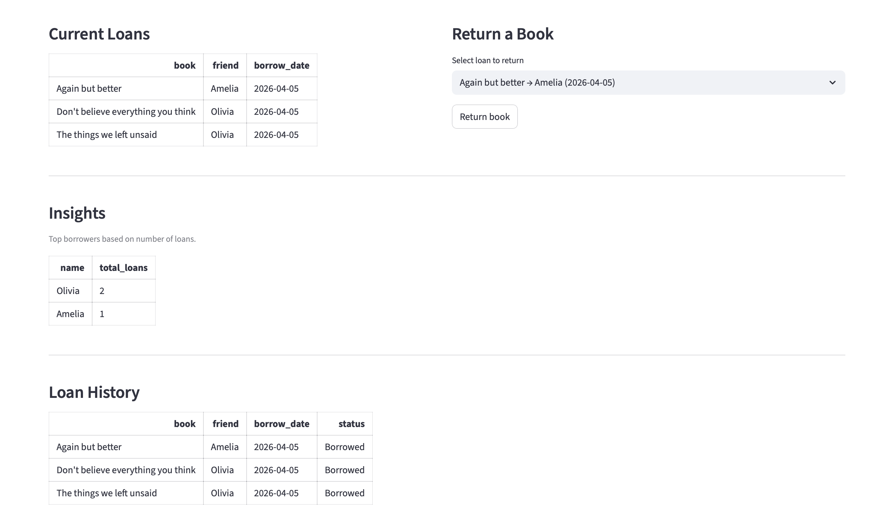

# Liane's Library

A Streamlit app to manage books, friends, and borrowing activity.

## Features
- Add and manage books  
- Add and manage friends  
- Borrow and return books  
- Track current loans  
- View loan history  
- Show top borrowers  
- Delete books, friends, and loan records  

## Tools Used
- Python  
- Streamlit  
- SQLite  
- SQLAlchemy  
- Pandas  

## Project Goal
This project was built to practice connecting Python with SQL and creating a simple library management workflow with an analytical feature.

---

## App Overview
Main interface showing current loans and return functionality.


---

## Top Borrowers Insight
This feature uses SQL aggregation to identify the most active borrowers based on total loan count.



---

## Delete Functionality
Allows deleting books, friends, and loan records directly from the interface.


---

## How to Run

```bash
pip install streamlit sqlalchemy pandas
streamlit run app.py
```
