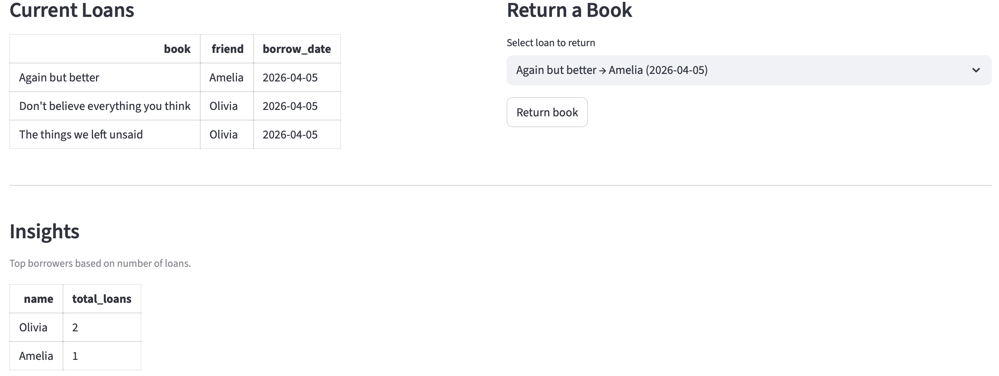
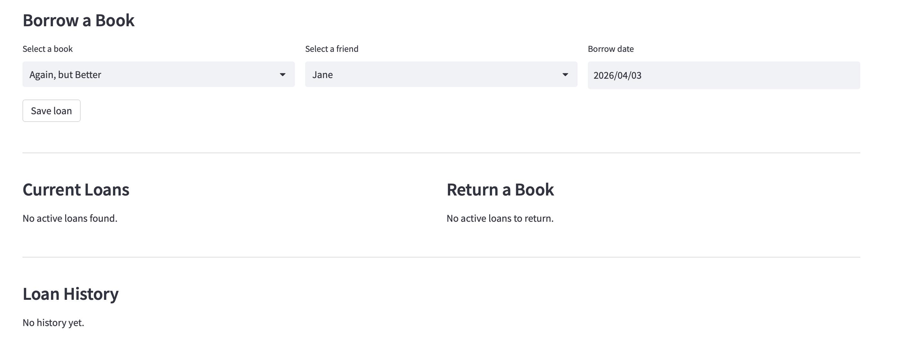
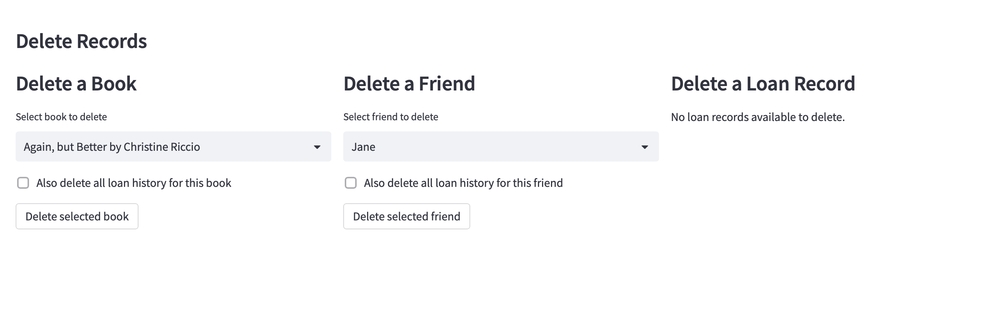

# Liane's Library App

This project is a small library management app built with Streamlit, SQLite, and SQLAlchemy. It lets users add books and friends, borrow and return books, track loan history, delete records, and view simple borrowing insights such as top borrowers.

---

## 🚀 Project Overview

The application allows users to manage a collection of books and track borrowing activity between friends. It focuses on handling relational data and ensuring consistency across operations such as adding, borrowing, and deleting records.

---


## Screenshots

### Overview


### Borrow System


### Delete Functionality



## 🧠 Key Features

- Add and manage books and friends
- Borrow and return books using a structured loan system
- Prevent duplicate borrowing of the same book
- Track borrowing activity and relationships between entities
- Delete records with optional cleanup of related data
- Maintain data integrity across all operations
- Show top borrowers based on loan history

---

## 🗄️ Data Model

The application is built around three main entities:

- **Books** → stores book titles and authors  
- **Friends** → stores user names  
- **Loans** → links books and friends (who borrowed what and when)

This structure simulates a relational database system where:
- one book can be borrowed multiple times
- one user can borrow multiple books
- relationships are tracked through a dedicated table

---

## ⚙️ Tech Stack

- Python  
- Streamlit  
- SQLite  
- SQLAlchemy  

---

## ▶️ How to Run

```bash
git clone https://github.com/Benguelees/lianes-library-app.git
cd lianes-library-app
pip install streamlit sqlalchemy pandas
python db_setup.py
streamlit run app.py
